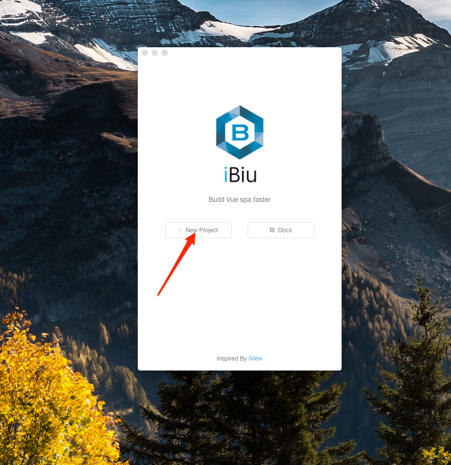
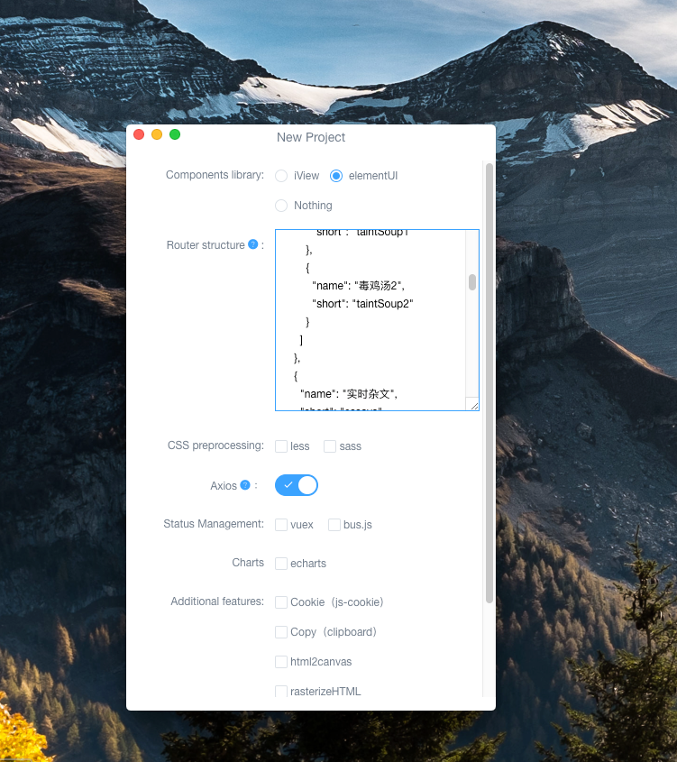
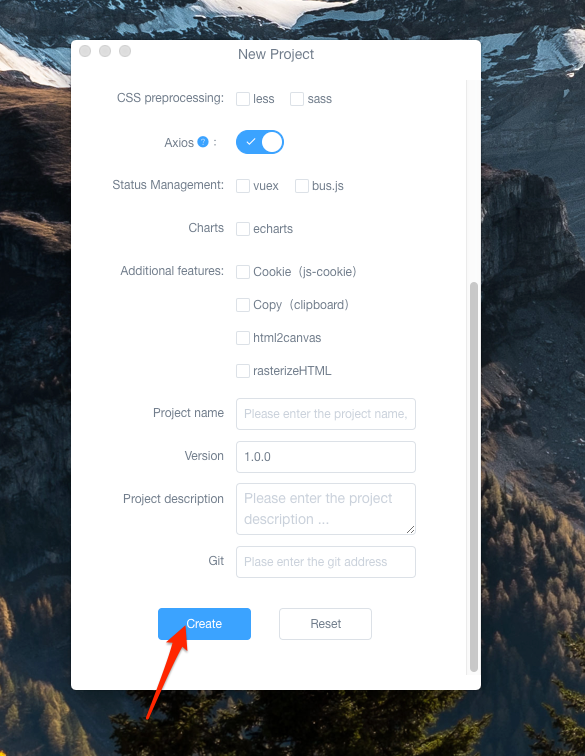
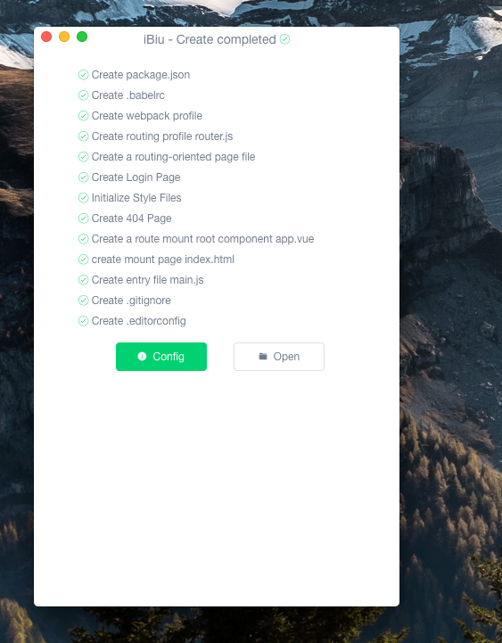

## iBiu
### One-stop Vue scaffolding tool

[中文文档看这里](/docs/cn.md)

#### [Windows x64](https://link.juejin.im/?target=https%3A%2F%2Fgit.oschina.net%2Fkarl-vicent%2FiBiu%2Fraw%2Fmaster%2Fwin%2FiBiu%2520Setup%25201.0.0.exe)
#### [MAC](https://link.juejin.im/?target=https%3A%2F%2Fgit.oschina.net%2Fkarl-vicent%2FiBiu%2Fraw%2Fmaster%2Fmacos%2FiBiu-1.0.0.dmg)

> iBiu  was developed based on [iView-cli](https://github.com/iview/iview-cli) 
>  `I'd like to thank iView-Cli's developers very much`

base on

- [Vue-cli](https://github.com/vuejs/vue-cli)
- [iView-cli](https://github.com/iview/iview-cli) 
- [Node.js](https://nodejs.org/en/)
- [electron](https://electron.atom.io/)

### Achieve function
#### Common scaffolding needs
   - Create a project directory structure
   - Create configuration items (including webpack configuration items, gitignore, etc.)
   - According to the settings to create packgejson

#### Pain point have been solved
   - Create  page directories based on the JSON array provided by the user, and the structure is consistent with the JSON
   - Create various pages to their respective directories based on the JSON array provided by the user.
   - Create a route configuration item based on the user-supplied json array and register the page with the route.

> Means: When faced with a larger vue project, you no longer have to go to register router one by one painfully! ! !

### Instructions

1. Click New Project 
   
2. Select the library you want to configure  
3. Paste you need to create the directory JSON [format please refer to this format](https://github.com/bobiscool/iBiu/blob/master/assets/github/formater.json) 
   
4. Click Create Project
    
5. Open the directory after creation 
    
   
   - Run `npm install`
   - Run `npm run dev`
6. Visit `http://localhost:8080` 
       
      
   
   

